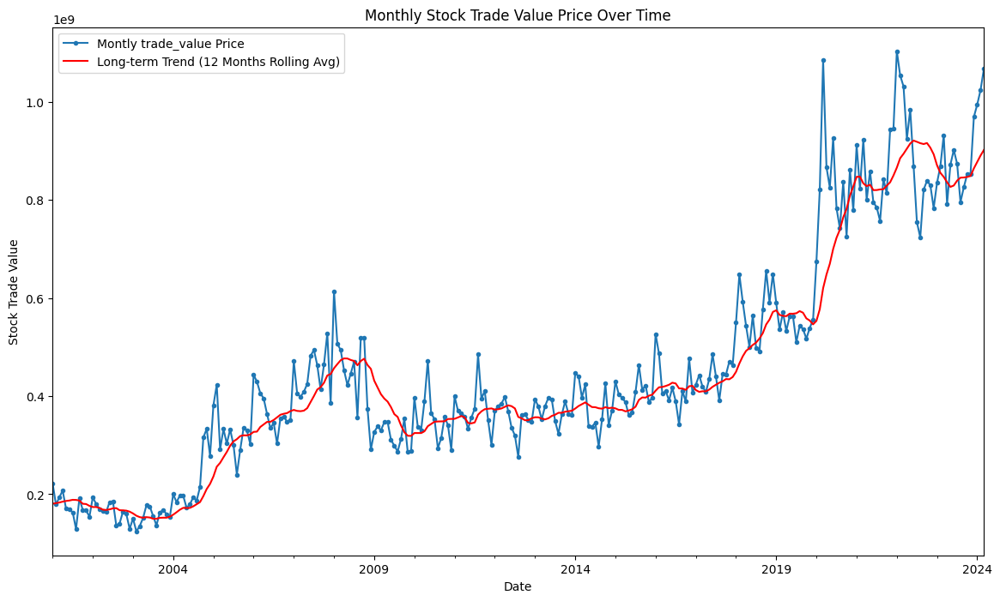
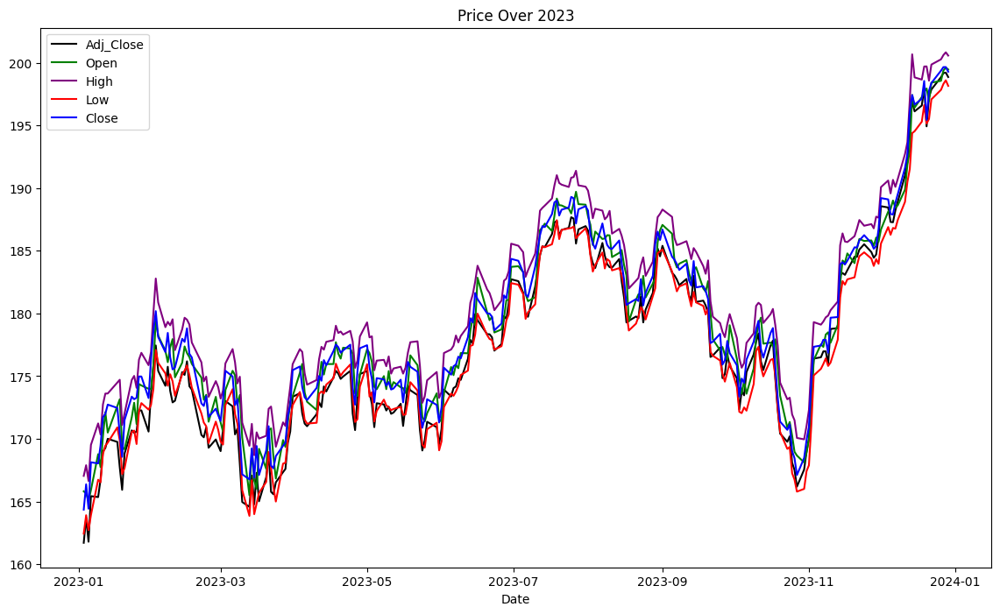
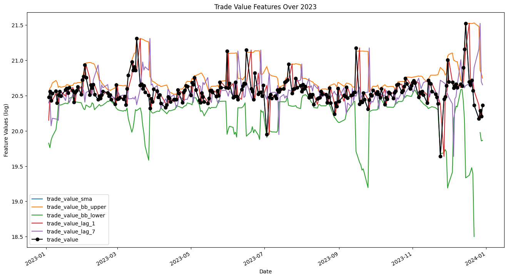
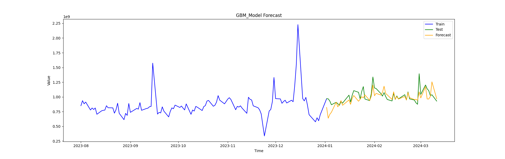

# Stock Trade Value Prediction - Multi-variate Time Series Analysis and Forecasting


<p style="text-align: center">Figure 1: Monthly Stock Trade Value Price</p>

The purpose of the project is to develop a multi-variate time series predictive model that can forecast the future stock 
trade value of a stock market index based on historical data. This could aid in making informed investment decisions.

## Project Plan

For the project plan, please refer to the [Project Plan](docs/Project_Plan.md) file.

The project plan outlines the steps and activities involved in developing a predictive model for stock price prediction.
It follows the CRISP-DM methodology and includes the following stages:

1. Business Understanding
2. Data Understanding
3. Data Preparation
4. Modeling
5. Evaluation
6. Deployment
7. Documentation and Reporting
8. Project Review

## Project Report

For the project report, please refer to the [Project Report](docs/Project_Report.md) file.

## Setup

For the setup of the project follow the instructions in the [SETUP.md](docs/SETUP.md) file.

## Project Structure

```bash
│
├── artifacts                 # folders excluded from the repo, what you store here it won't be store in the repo
│     ├── data
│     └── models
│
├── docs                     # folder for reports, documentation, images, etc.
│
├── src                      # source code folder for common code and for CRISP-DM steps
│     ├── common
│     ├── data_understanding
│     ├── data_preparation
│     ├── ...               
│     └── modelling
│
├── dev-requirements.txt     # development dependencies of the library in pip format
├── environment.yaml         # conda formatted dependencies, used by 'make init' to create the virtualenv
├── README.md                
└── requirements.txt         # core dependencies of the library in pip format
```

## Dataset

The dataset chosen contains the daily stock prices of the S&P 500 index spanning from 1999 to 2024 per company, which is
a benchmark index that tracks the performance of 500 large-cap companies listed on stock exchanges in the United States.
It's ideal to capture long-term trends and patterns.


<p style="text-align: center">Figure 2: Stock Price Variables over 2023</p>

The source of the dataset is from Hugging Face [jwigginton/timeseries-daily-sp500](https://huggingface.co/datasets/jwigginton/timeseries-daily-sp500).

It contains the following features:
   - `symbol`: The stock symbol of the company.
   - `date`: The trading date.
   - `open`: The price at which the stock opened on a given day.
   - `high`: The highest price of the stock on that day.
   - `low`: The lowest price of the stock on that day.
   - `close`: The closing price of the stock on that day.
   - `volume`: The number of shares traded on that day.
   - `adj_close`: The closing price adjusted for dividends and stock splits.


It can be retrieve using pandas:

```python
import pandas as pd

data = pd.read_parquet("hf://datasets/jwigginton/timeseries-daily-sp500/data/train-00000-of-00001.parquet")
```

Also, you can find it in the `bin/data/` folder of the project after executing the `common.util.get_data` function or
any of the steps which uses the original data, e.g. in the data understanding and preparation.

For the features already prepared you can use `common.data_preparation.get_features_and_target` function. As explained 
previously, it returns the features and target for the models.

```python
from common.data_preparation import get_features_and_target

x_train, y_train, x_test, y_test = get_features_and_target()
```

## Data Preparation

Applied several techniques, such as:

- **Differentiation:** To make the time series data stationary.
- **Moving Averages:** SMA, WMA, and EMA were used to smooth the series and highlight longer-term trends.
- **Relative Strength Index (RSI):** To measure the speed and change of price movements.
- **Bollinger Bands:** To provide a relative definition of high and low prices.
- **Lag Features:** To incorporate the effect of past values into our models.


<p style="text-align: center">Figure 2: Trade Value Features</p>


## Insights of Iteration 1

Following the initial iteration in the data understanding phase, several insights have been gathered:

- The close price has been identified as not the most relevant variable for predicting index performance. Consequently, 
the Stock Trade Value has been included for the second iteration of the data understanding phase at 
`src/data_understading/stock_trade_value_eda.py`.
- It has been observed that stock prediction and stock trade value can be significantly influenced by factors beyond 
the current dataset, including exogenous variables relevant to real-world scenarios.

## Insights of Final Iteration


<p style="text-align: center">Figure 3: Gradient Boosting Machine Forecast</p>

- Data Preparation: Techniques like differentiation and moving averages can help with model readiness and performance.
- Performance analysis: Statistical models like ARIMA offered moderate results; complex models like dynamic regression and gradient boosting machine performed better.
  - ARIMA: Parameter selection and autocorrelation influence the ARIMA model's effectiveness. 
  - Hybrid Models: VAR + Linear Regression didn't perform well.
  - Gradient Boosting Machine: GBM showed competitive results, indicating its potential for stock price prediction.
- Exogenous Factors: Stock predictions can be influenced by external factors, underscoring the need for integrating additional variables.
- Evaluation Metrics: Metrics like MAE, MSE, and RMSE provide a way to compare model strengths and areas for improvement. At the same time,
other metrics like AIC, BIC, and HQIC could interpret better the model's performance.
- Future Exploration: More complex architectures and additional features like economic indicators could enhance predictions.

# Conclusion

This project provided valuable insights into the predictive modeling of stock prices using time series data. Through comprehensive data preparation, modeling, and evaluation, we identified effective strategies and models for stock price prediction. 

In the future could focus on enhancing model architectures and integrating more diverse data sources to improve prediction accuracy.
