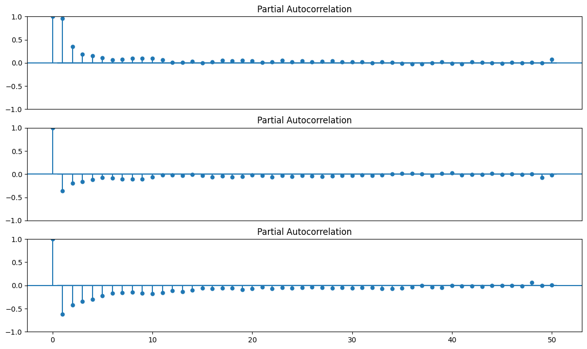
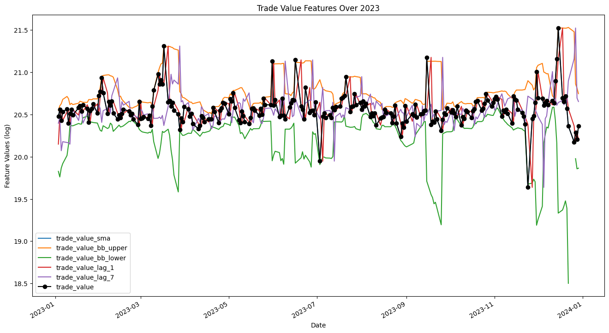

<h1 style="text-align: center"> Report Stock Trade Value Prediction </h1>

## Introduction

This project focuses on predicting stock prices using historical data. The goal is to leverage this data to forecast future stock values, which can be instrumental in:

- **Improving investment strategies:** By predicting stock prices, investors can make more informed decisions about when to buy or sell stocks.
- **Enhancing decision-making processes:** Companies and individual investors can use predictions to shape their financial strategies and mitigate risks.
- **Risk management:** Accurate predictions can help in assessing potential risks and rewards, aiding in more robust risk management strategies.

Figure 1: Monthly Stock Trade Value Price

## Project Planning

The project was structured as follows:

1. **Define a project plan:** Outlining objectives, scope, and deliverables. You can check the project plan [here](Project_Plan.md).
2. **Set up the project:** Establishing the technical infrastructure and tools needed.
3. **Data Understanding:** Analyzing the available data to find patterns and anomalies.
4. **Data Preparation:** Cleaning and transforming data for modeling.
5. **Feature Engineering:** Creating new features to improve model performance.
6. **Modeling:** Building and training predictive models.
7. **Evaluation:** Assessing the performance of the models.

## Data Understanding

### Exploratory Data Analysis

- **Statistical Analysis:** We performed descriptive statistics to understand the distribution and central tendencies of the data.
- **Data Visualization:** Various plots were used to visualize trends, patterns, and outliers in the data.

### Time Series Analysis

We conducted a Time Series Analysis to understand the characteristics of the stock price data. Key findings include:

- **Stationarity Test:** Using the Augmented Dickey-Fuller test, we identified that most series were non-stationary except for the volume.
- **Differencing:** To achieve stationarity, differencing was applied, as shown in the figures below. Models like ARIMA, includes the differencing parameter $d$ to make the time series stationary and others like VAR assume that the data is stationary.

For checking other parameters of the ARIMA model, we used the AutoCorrelation Function (ACF) and Partial AutoCorrelation Function (PACF) plots of the data and the first and second order difference.

Figure 2: Data and First and Second Order Difference of Trade Value

$d$ value of the ARIMA model is determined by the number of differences needed to make the time series stationary. 

Figure 3: ACF of Data and First and Second Order Difference

$p$ value of the ARIMA model are determined by the number of lags in the autoregressive components of the model, for this we can check the ACF plots of the data and the first and second order difference are shown in the figures above. Having only the flag 1 (second) with a significant value in the first order difference. This means the optimal value is $p=1$, or around it.

Figure 4: PACF of Data and First and Second Order Difference

$q$ value of the ARIMA model are determined by the number of lags in the moving average 
components of the model, for this the PACF plots of the data and the first and second order difference are shown in the figures above. Having only the flag 1 (second)  and 2 (third) with a significant value in the first order difference. This means the optimal value is $q=1$, or around it.

The second order difference didn't change much in any of the plots compared with the first order difference, so the optimal value is $d=1$, finally proposing the order $(1,1,1)$ as possible the optimal values for the ARIMA model.

## Data Preparation

Applied several techniques, such as:

- **Differentiation:** To make the time series data stationary.
- **Moving Averages:** SMA, WMA, and EMA were used to smooth the series and highlight longer-term trends.
- **Relative Strength Index (RSI):** To measure the speed and change of price movements.
- **Bollinger Bands:** To provide a relative definition of high and low prices.
- **Lag Features:** To incorporate the effect of past values into our models.

Figure 5: Trade Value Features

## Modeling and Evaluation

We evaluated our models based on several metrics:

- Mean Squared Error (MSE)
- Mean Absolute Error (MAE)
- Mean Absolute Percentage Error (MAPE)
- Root Mean Squared Error (RMSE)

### Models Overview

- **ARIMA:** Focused on capturing the autocorrelations in the data.
- **VAR + Linear Regression:** Used to forecast interdependent time series and regressions.
- **Dynamic Regression:** To model dependencies across time with external regressors.
- **Gradient Boosting Machine (GBM):** An ensemble technique for robust predictions.
- **Long Short-Term Memory (LSTM):** A deep learning approach for sequential data.

### ARIMA

ARIMA (AutoRegressive Integrated Moving Average) is a time series forecasting algorithm that is used to predict future data points based on the historical data. Utilized for its simplicity in modeling time series data. It works by incorporating the dependency between an observation and a number of lagged observations. The ARIMA model is composed of three main parts:
- AR (AutoRegressive): A regression model that utilizes the dependent relationship between a current observation and observations over a previous period. Defined by the parameter $p$.
- I (Integrated): Differencing of raw observations to make the time series stationary. Defined by the parameter $d$.
- MA (Moving Average): A model that uses the dependency between an observation and a residual error from a moving average model applied to lagged observations. Defined by the parameter $q$.

The ARIMA model the series of the stock price data and predicts the future stock price based on the historical data. The ARIMA model is implemented using the `statsmodels` library in Python.

Based in the differencing, ACF and PACF plots the most suitable order $(p,d,q)$ for the ARIMA model was determined to be $(1, 1, 1)$, but we tried also with $(1, 1, 2)$, $(2, 1, 1)$ and $(2,1,2)$ to compare the results.

The results of the ARIMA model are shown in the following table:

| Model         | MAE             | MSE       | RMSE            | MAPE   |
|---------------|-----------------|-----------|-----------------|--------|
| ARIMA(1,1,1)  | 132180042.872   | 2.89e+16  | 170255756.1468  | 0.1209 |
| ARIMA(1,1,2)  | 142602466.0437  | 3.182e+16 | 178400733.1689  | 0.1314 |
| ARIMA(2,1,1)  | 135588660.7952  | 2.996e+16 | 173093612.6619  | 0.1243 |
| ARIMA(2,1,2)  | 144842051.2899  | 3.245e+16 | 180139189.383   | 0.1336 |

Table 1: ARIMA metrics

Figure 6: ARIMA(1,1,1) Forecast

The forecast above may not look very impressive, as it is almost a straight line. This is because this is a very simple, univariate forecasting model. Nonetheless, keep in mind that these simple forecasting models can be extremely  competitive.

Residuals of the ARIMA(1,1,1) model:

Figure 7: Residuals of ARIMA(1,1,1)

The residuals of the ARIMA(1,1,1) model seem to indicate distribution with very high kutosis, which means that the residuals are very peaked and have heavy tails. This is not a good sign, as it indicates that the model is not capturing the underlying patterns as seens previosuly in the metrics.

### Dynamic Regression

This approach models the dependent variable using lagged values of itself and lagged values of one or more predictors. 

It includes ARIMA structures for the error term, making it flexible for handling various types of time series data. Suitable when you need to model the impact of sudden changes in predictor variables on a dependent variable over time.

Figure 8: Dynamic Regression Forecast

Results:

- MAE: 75556433.9288,
- MSE: 1.098e+16,
- RMSE: 104786205.8346,
- MAPE: 0.0715

### Hybrid Model (VAR + Linear Regression)

The VAR model is a multivariate forecasting model that is used when two or more time series influence each other (endogenous variables). The VAR model is implemented using the `statsmodels` library in Python.

The approach followed consist in using the VAR model to forecast the predictors first (excluding the target variable) and then use a Linear Regression model to forecast the target variable based on the forecasted predictors.

This approach allows to use the strengths of VAR for modeling the relationships among predictors while using a more flexible approach for forecasting the target variable based on those predictors.

Figure 9: VAR Trade Value Forecast

Results:
- MAE: 93139469.5997,
- MSE: 1.7364+16,
- RMSE: 131774979.4655,
- MAPE: 0.9981

### Gradient Boosting Machine

Powerful for handling various types of data and capturing complex patterns. Achieved relative competitive forecasting results, suggesting its efficacy in non-linear scenario modeling.

Figure 10: Gradient Boosting Machine Forecast

Results:

- MAE: 77104226.3294,
- MSE: 1.1936036569911202e+16,
- RMSE: 109252169.6348,
- MAPE: 0.0735

### Long short-term memory (LSTM)

Long Short-Term Memory (LSTM) is a type of RNN architecture, and are often used to model and predict sequential data, such as time series. LSTMs are particularly effective for capturing long-range dependencies and patterns in data due to their unique cell structure, which includes gates for controlling the flow of information. This makes them well-suited for stock price prediction, where capturing trends and temporal dependencies are beneficial. 

#TODO: ...

# Insights

- Data Preparation: Techniques like differentiation and moving averages can help with model readiness and performance.
- Performance analysis: Statistical models like ARIMA offered moderate results; complex models like dynamic regression, gradient boosting machine, and LSTM performed better.
  - ARIMA: Parameter selection and autocorrelation influence the ARIMA model's effectiveness. 
  - Hybrid Models: VAR + Linear Regression didn't perform well.
- Exogenous Factors: Stock predictions can be influenced by external factors, underscoring the need for integrating additional variables.
- Evaluation Metrics: Metrics like MAE, MSE, and RMSE provide a way to compare model strengths and areas for improvement.
- Future Exploration: More complex architectures and additional features like economic indicators could enhance predictions.
- Real-World Applications: Models have practical value in investment strategies, decision-making, and risk management.

# Conclusion

This project provided valuable insights into the predictive modeling of stock prices using time series data. Through comprehensive data preparation, modeling, and evaluation, we identified effective strategies and models for stock price prediction. 

Future could focus on enhancing model architectures and integrating more diverse data sources to improve prediction accuracy.
